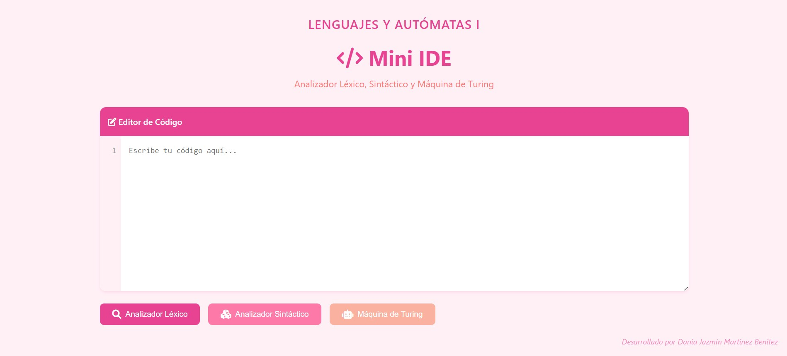

# Analizador Léxico y Sintáctico 🚀

[](https://www.python.org/)
[](https://flask.palletsprojects.com/)
[](https://opensource.org/licenses/MIT)

> Analizador de lenguaje personalizado con interfaz web moderna que incluye análisis léxico y sintáctico.

<div align="center">
  
  
</div>

---

## 📑 Tabla de Contenidos
- [Analizador Léxico y Sintáctico 🚀](#analizador-léxico-y-sintáctico-)
  - [📑 Tabla de Contenidos](#-tabla-de-contenidos)
  - [📋 Datos del estudiante](#-datos-del-estudiante)
  - [💻 Interfaz Gráfica del IDE](#-interfaz-gráfica-del-ide)
  - [🚀 Instrucciones de Ejecución](#-instrucciones-de-ejecución)
    - [Prerrequisitos](#prerrequisitos)
    - [Pasos de Instalación](#pasos-de-instalación)
  - [📁 Estructura del Proyecto](#-estructura-del-proyecto)
  - [🔍 Analizador Léxico](#-analizador-léxico)
    - [🎯 Tokens](#-tokens)
    - [📝 Tabla de Tokens](#-tabla-de-tokens)
    - [✨ Características](#-características)
  - [🔧 Analizador Sintáctico](#-analizador-sintáctico)
    - [📚 Gramática](#-gramática)
      - [1️⃣ Declaración de Variables](#1️⃣-declaración-de-variables)
      - [2️⃣ Operaciones Aritméticas](#2️⃣-operaciones-aritméticas)
      - [3️⃣ Impresión](#3️⃣-impresión)
    - [⚙️ Características](#️-características)
    - [📋 Reglas y Restricciones](#-reglas-y-restricciones)
      - [Variables](#variables)
      - [Tipos de Datos](#tipos-de-datos)
      - [PRINT](#print)
      - [Operaciones](#operaciones)
    - [💡 Ejemplos](#-ejemplos)
      - [✅ Código Válido](#-código-válido)
      - [❌ Código Inválido](#-código-inválido)
  - [🤖 Máquina de Turing](#-máquina-de-turing)
    - [🎯 Características](#-características-1)
      - [1️⃣ Reglas de Validación](#1️⃣-reglas-de-validación)
      - [2️⃣ Estados](#2️⃣-estados)
      - [3️⃣ Funcionamiento](#3️⃣-funcionamiento)
    - [📝 Ejemplos](#-ejemplos-1)
      - [✅ Cadena Aceptada](#-cadena-aceptada)
      - [❌ Cadenas Rechazadas](#-cadenas-rechazadas)

---

## 📋 Datos del estudiante

| **Nombre**  | Martinez Benitez Dania Jazmin |
|------------|------------------------------|
| **Materia**| Lenguajes y Autómatas I      |
| **Profesor**| Kevin David Molina Gomez     |

## 💻 Interfaz Gráfica del IDE

La interfaz del IDE ha sido diseñada para ser intuitiva y fácil de usar, con un diseño moderno y funcional.



**Características de la interfaz:**
- Editor de código con numeración de líneas
- Botones para análisis léxico, sintáctico y máquina de Turing
- Diseño responsivo y amigable


## 🚀 Instrucciones de Ejecución

### Prerrequisitos
- Python 3.x
- pip (gestor de paquetes de Python)

### Pasos de Instalación

1. **Crear y activar entorno virtual** 🔧
   ```bash
   # Crear entorno virtual
   python -m venv venv

   # Activar entorno (Windows)
   .\venv\Scripts\activate

   # Activar entorno (Linux/Mac)
   source venv/bin/activate
   ```

2. **Instalar dependencias** 📦
   ```bash
   pip install flask
   ```

3. **Ejecutar la aplicación** ▶️
   ```bash
   python app.py
   ```

4. **Acceder a la aplicación** 🌐
   ```
   http://localhost:5000
   ```

---
## 📁 Estructura del Proyecto
```
.
├── app.py              # Servidor Flask y rutas
├── lexer.py           # Analizador léxico
├── parser.py          # Analizador sintáctico
├── turing_machine.py  # Implementación de máquina de Turing
├── static/           
│   ├── style.css     # Estilos de la interfaz
│   └── script.js     # Lógica del cliente
└── templates/
    └── index.html    # Plantilla principal
```

---
## 🔍 Analizador Léxico

### 🎯 Tokens
- **Tipos de Datos:** `Int`, `String`
- **Palabras Clave:** `PRINT`, `MAS`, `MENOS`
- **Símbolos:** `=`, `;`, `(`, `)`
- **Identificadores:** Variables (letras, números y guion bajo)
- **Cadenas de texto:** Números enteros y texto entre comillas

### 📝 Tabla de Tokens
| Token          | Descripción              | Ejemplo           |
|----------------|-------------------------|-------------------|
| Número         | Números enteros         | 42, 123          |
| Identificador  | Nombres de variables    | x, contador      |
| TipoDato       | Tipos Int o String      | Int, String      |
| Imprimir       | Comando de impresión    | PRINT            |
| Asignación     | Operador de asignación  | =                |
| Suma           | Operador de suma        | MAS              |
| Resta          | Operador de resta       | MENOS            |
| ParéntesisIzq  | Paréntesis izquierdo    | (                |
| ParéntesisDer  | Paréntesis derecho      | )                |
| PuntoYComa     | Terminador              | ;                |
| Texto          | Cadenas de texto        | "Hola mundo"     |

### ✨ Características
- Identificación de tokens
- Detección de caracteres inválidos
- Mensajes de error detallados
- Validación en tiempo real
- Resaltado de errores léxicos

---

## 🔧 Analizador Sintáctico

### 📚 Gramática

#### 1️⃣ Declaración de Variables
```python
Int variable = número;
String variable = "texto";
```

#### 2️⃣ Operaciones Aritméticas
```python
variable = número/variable MAS número/variable;
variable = número/variable MENOS número/variable;
```

#### 3️⃣ Impresión
```python
PRINT(texto/variable);
```

### ⚙️ Características
- Validación de estructura de código
- Verificación de tipos de datos
- Detección de errores de sintaxis
- Mensajes de error descriptivos
- Análisis de expresiones y declaraciones

### 📋 Reglas y Restricciones

#### Variables
- ✅ Deben comenzar con letra
- ✅ Pueden contener letras, números y guion bajo
- ❌ No pueden usar caracteres especiales

#### Tipos de Datos
- `Int`: Solo acepta números enteros
- `String`: Solo acepta texto entre comillas

#### PRINT
- ✅ Acepta texto entre comillas
- ✅ Acepta variables
- ❌ No acepta números directamente

#### Operaciones
- ✅ Solo operaciones MAS y MENOS
- ✅ Operandos: números o variables

### 💡 Ejemplos

#### ✅ Código Válido
```python
Int edad = 25;
String nombre = "Juan";
PRINT(nombre);
edad = edad MAS 1;
edad = edad MENOS 1;
PRINT("Edad actualizada");
```

#### ❌ Código Inválido
```python
# Error: tipo de dato en minúsculas
int edad = 25;

# Error: variable inválida con caracteres especiales
Int edad@ = 25;

# Error: tipo de dato incorrecto
String edad = 25;
Int numero = "Cinco";

# Error: falta punto y coma
Int x = 10

# Error: PRINT con número
PRINT(42);

# Error: Operador en minuscula
numero= 5 mas 5;
```

---

## 🤖 Máquina de Turing

La implementación incluye una máquina de Turing que valida cadenas de 0's y 1's con reglas específicas.

### 🎯 Características

#### 1️⃣ Reglas de Validación
- La cadena no debe estar vacía
- Solo puede contener 0s y 1s
- Debe iniciar con 1
- Debe tener una cantidad par de 0s
- Debe tener una cantidad par de 1s

#### 2️⃣ Estados
- Estado inicial: Verifica si la cadena está vacía
- Estado de validación de primer carácter (debe ser 1)
- Estado de conteo de 0s y 1s
- Estados de aceptación y rechazo

#### 3️⃣ Funcionamiento
- Lee la cadena de entrada
- Verifica el primer carácter (1)
- Cuenta la cantidad de 0s y 1s
- Valida la paridad de ambos dígitos
- Emite un resultado de aceptación o rechazo

### 📝 Ejemplos

#### ✅ Cadena Aceptada
```
Entrada: 1100
Resultado: ✅ Cadena aceptada: hay 2 ceros y 2 unos (ambos son pares) y la cadena inicia con 1.

Entrada: 11110000
Resultado: ✅ Cadena aceptada: hay 4 ceros y 4 unos (ambos son pares) y la cadena inicia con 1.

Entrada: 101010101010
Resultado: ✅ Cadena aceptada: hay 6 ceros y 6 unos (ambos son pares) y la cadena inicia con 1.
```

#### ❌ Cadenas Rechazadas
```
Entrada: 0110
Resultado: ❌ Cadena rechazada: la cadena debe iniciar con 1.

Entrada: 1010
Resultado: ❌ Cadena rechazada: hay 2 ceros y 2 unos (deben ser pares) y la cadena debe iniciar con 1.

Entrada: ""
Resultado: ❌ Cadena rechazada: la cadena está vacía.
```

La máquina de Turing proporciona una validación formal de cadenas binarias, asegurando que cumplan con las reglas especificadas de paridad y estructura.

---

## 📝 Conclusión

Este proyecto, desarrollado para la materia de Lenguajes y Autómatas I, tiene un propósito puramente académico y educativo, sirviendo como una herramienta práctica para comprender mejor los conceptos fundamentales de la teoría de autómatas y lenguajes formales.

---

<div align="center">
  <p>Desarrollado por Dania Jazmin Martinez Benitez</p>
</div>


